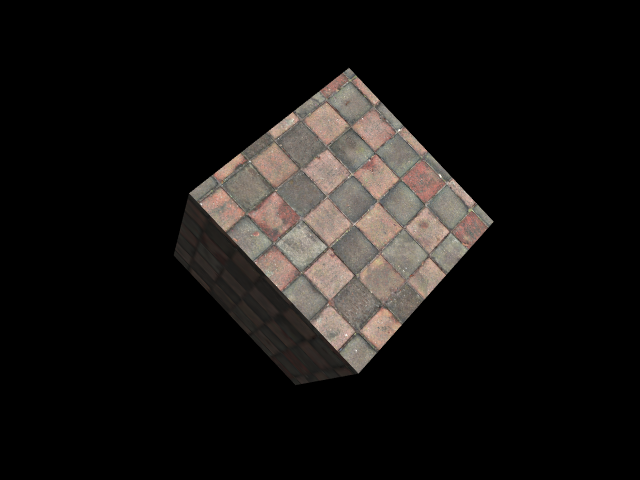

# 绘制真实感的景物

## 项目文件结构

```
.
├── dist // 打包后的文件
├── public // 静态文件
│   ├── favicon.ico // 图标
│   └── index.html // HTML 模板
├── src
│   ├── bind-data.ts // 绑定数据到缓冲区
│   ├── img
│   │   └── wall.jpg // 纹理图片
│   ├── index.less // 样式
│   ├── index.ts // 入口文件
│   ├── shaders
│   │   ├── fragment.frag // 片段着色器
│   │   └── vertex.vert // 顶点着色器
│   ├── types.d.ts // 类型声明
│   └── utils
│       ├── buffer.ts // 创建并绑定数据到缓冲区
│       ├── enable-vertex-attribute.ts // 激活指定的 attribute
│       ├── index.ts
│       ├── init.ts // 初始化 WebGL 渲染程序
│       └── texture.ts // 加载纹理
└── ... // 其它辅助文件
```

## 项目简介

本项目使用 [WebGL](https://developer.mozilla.org/en-US/docs/Web/API/WebGL_API) 渲染了一个在空间中旋转的正方体，并使用纹理图片给它加上了类似 “砖墙” 的样式，同时还添加了环境光和方向光。

### 使用方法

本项目是一个纯前端的项目，使用 Typescript 作为开发语言，使用 Less 书写样式，用 webpack 打包输出最终的网页代码。打包后的文件在 `dist` 文件夹中，直接用浏览器打开 `dist/index.html` 即可查看最终的效果。

## WebGL 简介

> WebGL 是一个 JavaScript API，可在任何兼容的 Web 浏览器中渲染高性能的交互式 3D 和 2D 图形。WebGL 通过引入一个与 OpenGL ES 2.0 非常一致的 API 来做到这一点，该 API 可以在 HTML5 `<canvas>` 元素中使用。 这种一致性使 API 可以利用用户设备提供的硬件图形加速。

WebGL 提供的 API 与 OpenGL API 基本一致，如要了解 OpenGL 的 API 可以参考[这个文档](https://learnopengl-cn.github.io/)，这里不再赘述。

## GLSL 简介

GLSL 是 OpenGL Shading Language 的缩写，它是类 C 语言的高级着色语言，让程序员可以更方便地控制 GPU 的绘图管线。GLSL 不能单独使用，它一般是以字符串的形式被主程序加载，然后编译、链接，最终在 GPU 上执行。在本项目中，着色器代码在 `src/shader` 文件夹下以单独的文件存储，并通过 webpack 的 `raw-loader` 以字符串的形式引入到程序中。

GLSL 的着色器分为顶点着色器和片段着色器两种。简单地说，顶点着色器负责给出要绘制的顶点的坐标，片段着色器负责给出相应点的颜色。GPU 在绘制每一个顶点时都会先后调用顶点着色器和片段着色器，并利用它们给出的结果绘图。对于不是顶点的部分，OpenGL 会通过线性插值的方式计算出相应的结果。

GLSL 中有三种类型的数据存储类型，分别是 `attribute`、`varying` 和 `uniform`。其中 `varying` 变量用于从顶点着色器向片段着色器传递数据，比如法向量、光照等在顶点着色器中计算出的数据。另外两种都是用于从外界代码向着色器传递数据，`attribute` 变量对于每一次计算都是不同的，它一般用于传递顶点位置、纹理坐标等信息；`uniform` 变量则有点类似于全局变量，在着色器每一次渲染时都保持一致（一次渲染包括对每一个顶点调用一次着色器），除非外界代码修改了它的值，它一般用于传递全局不变的数据，比如方向光的方向、颜色等。

## 坐标系统

对于一般的渲染程序来说来说有比较重要的五个不同的坐标系统：

1. 局部空间（Local Space）
   局部空间常用于描述物体本身的形状，而无需考虑物体在空间中的位置
1. 世界空间（World Space）
   世界空间用于描述物体在世界中的位置。将物体从局部空间变换到世界空间的是模型矩阵（Model Matrix），模型矩阵能通过对物体进行平移、旋转、缩放等操作将物体放置在世界中的适当位置处。
1. 观察空间（View Space）
   观察空间是基于用户视野的坐标空间。将物体从世界空间变换到观察空间的是视图矩阵（View Matrix）。
1. 裁剪空间（Clip Space）
   OpenGL 对可见范围有一个限制，只有在这个特定坐标范围内的点才是可见的，范围之外的点都会被裁剪掉，这就是裁剪空间。将物体从观察空间变换到裁剪空间的是投影矩阵（Projection Matrix）。裁剪空间的可见范围是三个坐标都在 -1 到 1 之间的部分。
1. 屏幕空间（Screen Space）
   屏幕空间即以图形显示器的显示空间。

### 透视投影

真实的三维物体都具有 “近大远小” 的效果，这被称为透视，在 OpenGL 中，可以使用透视投影矩阵来实现这种效果。透视投影变换会将远处的点的 $w$ 坐标变得更大，由于计算实际坐标时会将所有坐标都除以 $w$ 得到最终的坐标，这样就会使远处的点的坐标变小，进而达到透视投影的效果。

透视投影矩阵有几个参数：

* 视野（Field of View，FOV）：它决定了观察空间的大小
* 宽高比：视口的宽与高的比
* 近平面和远平面：它们决定了离观察点多远范围内的物体是可见的


## 颜色与光照

### 颜色

物体的颜色是其反射的光的颜色，在有色光的照射下，设物体本身的颜色为 $(r_o,g_o,b_o)$，光的颜色为 $(r_L,g_L,b_L)$，则最终得到的物体颜色应为 $(r_or_L,g_og_L,b_ob_L)$，即相应颜色分量相乘的结果。本项目中在 `src\shaders\fragment.frag` 中就是使用这种方式计算最终的颜色的：

```glsl
gl_FragColor = vec4(texelColor.rgb * vLighting, texelColor.a);
```

### 光照

关于光照的模型有很多，其中一个模型被称为冯氏光照模型（Phong Lighting Model）。冯氏光照模型的主要结构由三个分量组成：环境光（Ambient）、漫反射光（Diffuse）和镜面光（Specular）。本项目中只使用了其中的环境光和漫反射光。

#### 环境光

本项目使用了非常简单的环境光处理算法，即直接将环境光加到其它光照的结果上，将其作为最终光照的颜色。

#### 漫反射

漫反射的光照也是符合光的反射定律的，所以为了计算漫反射的结果，我们需要知道入射光的方向，以及反射点的法线的方向（即法向量）。因为本项目绘制的图形只是简单的正方体，所以各个面的法向量直接以 `attribute` 数据的形式给出。而此处用到的光照是平行光，光的方向直接硬编码在着色器代码中。然后计算入射光与法向量的夹角，由于两个向量都是单位向量，所以只需要计算它们的点乘结果。最后将这个结果与光的颜色相乘，就得到了漫反射光照的效果。

#### 法向量

上面的计算过程中还有一点需要注意，即代码中给出的法向量是局部坐标下的法向量，而在计算时需要的是世界空间中的法向量。而完成坐标变换的模型矩阵不能用于法向量的变换，因为如果变换中存在不等比缩放，则会导致法向量不再与相应的平面垂直，如下图所示：


所以我们还需要专门为法向量变换设计的模型矩阵，称为法线矩阵（Normal Matrix），它是模型矩阵的逆矩阵的转置，`src\index.ts` 的第 94 到 96 行计算了这个矩阵。

## 效果示例



## 参考

1. [MDN WebGL 文档](https://developer.mozilla.org/en-US/docs/Web/API/WebGL_API)
2. [LearnOpenGL CN](https://learnopengl-cn.github.io/)
3. [WebGL 理论基础](https://webglfundamentals.org/webgl/lessons/zh_cn/)

